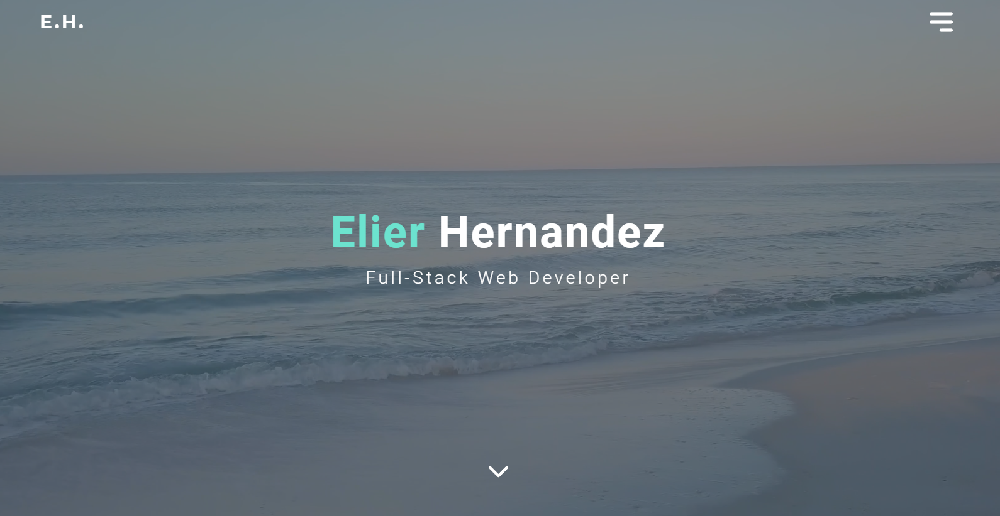

# Portfolio



#### Top Technologies

[](#) [](#)

My portfolio was built to showcase projects and information that you might want to know about me. It includes a download link to my CV, as well as a contact link connected to my email.

This website was built with React and Gatsby, using Emotion JS for handling the CSS.

## Installation

1. Download repository
   ```bash
   git clone git@github.com:ElierHP/portfolio.git
   ```
2. Install packages
   ```bash
   npm install
   ```

## Start Application

1. run application
   ```bash
   gatsby develop
   ```

#### :mailbox: Reach out to me!

- :clipboard: [My Resume/CV]()
- :email: elierporto@gmail.com
- :page_facing_up: [elierhernandez.netlify.app](https://www.elierhernandez.netlify.app)
